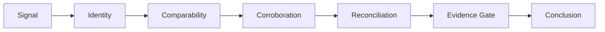

<div align="center">

# CIIP Public Procurement Intelligence

### Evidence-Governed Procurement Transaction Intelligence

**Real Data. Real Investigation. Real Learnings.**

[Study #001](case_study/CIIP_Public_Study_001_San_Francisco_Report.pdf) ·
[Methodology](docs/01-methodology.md) ·
[Indicator Library](methodology/CIIP_Indicator_Library_and_Evidence_Gate_v1_0.xlsx) ·
[False-Positive Tests](tests/CIIP_SF001_False_Positive_Stress_Test_and_Launch_Gate_v1_0.xlsx) ·
[Substack Article](https://indiasupplychainsignals.substack.com/p/i-found-a-procurement-anomaly-then)

</div>

---

## Why this repository exists

Procurement analytics can identify unusual transactions.

The harder problem is determining **what the evidence actually supports**.

This repository documents the public research methodology developed by **CIIP Intelligence Advisory** and demonstrated through **Public Procurement Intelligence Study #001**, a transaction-level investigation using San Francisco public procurement data.

The project deliberately separates:

> **Signal → Evidence → Validation → Commercial Impact**

It does **not** treat an anomaly as proof of leakage, fraud, overbilling, savings or recovery.

---

## Study #001 — San Francisco

The investigation narrowed a public procurement population to:

| Measure | Result |
|---|---:|
| Distinct purchase orders | **42** |
| Transaction rows | **124** |
| Total encumbered value | **$107,285.70** |
| Total paid value | **$99,210.11** |
| Payment difference | **$8,075.59 lower paid** |

**Context:** FY2022 · DPH Public Health · Golden Gate Neuromonitoring LLC · Contract 1000008139 · Commodity 46500 · PO date 13 June 2022.

### Final conclusion

> **Investigation priority — YES.**  
> **Commercial leakage established — NO.**

The investigation also corrected an earlier aggregation error in which line/row activity had been interpreted as distinct POs and partial-line spend had been interpreted as total cluster spend.

That correction is intentionally documented because analytical integrity matters as much as anomaly detection.

---

## The CIIP evidence architecture



### Controlled conclusion states

1. **Signal**
2. **Investigation Priority**
3. **Evidence-Supported Discrepancy**
4. **Potential Exposure**
5. **Validated Commercial Impact**
6. **Recovery / Correction**
7. **Cleared / Explained**

The state should move only when the evidence supports the next level.

---

## What makes the approach different

CIIP does **not** claim that procurement anomaly detection is novel.

Established public-procurement analytics already includes mature red-flag methodologies and automated detection systems.

The proposed CIIP contribution is the **evidence architecture around the signal**:

**Data coverage → Indicator eligibility → Detection → Comparability → Corroboration → Reconciliation → Evidence gate → Commercial state**

The system is designed to answer not only:

> *“What looks unusual?”*

but also:

> *“What can we responsibly conclude?”*

---

## False-positive principle

A material case should be subjected to deliberate attempts to weaken or disprove it.

Examples from Study #001:

- broad cluster → narrower identity
- row count → distinct PO reconstruction
- partial-line amount → total transaction reconstruction
- threshold signal → authority/intent evidence check
- price variance → comparability and contract-context check
- payment mismatch → directional reconciliation
- supplier-only matching → multi-field identity
- missing evidence → conclusion downgrade

> **The system should not only find suspicious cases. It should try to kill them.**

---

## Repository structure

```text
CIIP_Public_Procurement_Intelligence/
│
├── README.md
├── CITATION.cff
├── LICENSE
├── CHANGELOG.md
├── CONTRIBUTING.md
├── SECURITY.md
│
├── assets/
│   ├── social-preview.jpg
│   └── study-001-hero.png
│
├── case_study/
│   ├── CIIP_Public_Study_001_San_Francisco_Report.pdf
│   └── CIIP_Public_Study_001_V2_Evidence_Governed_Procurement_Intelligence.docx
│
├── data/
│   └── README.md
│
├── docs/
│   ├── 01-methodology.md
│   ├── 02-study-001.md
│   ├── 03-evidence-gate.md
│   ├── 04-reproducibility.md
│   ├── 05-limitations.md
│   └── 06-benchmark-landscape.md
│
├── methodology/
│   └── CIIP_Indicator_Library_and_Evidence_Gate_v1_0.xlsx
│
├── references/
│   └── source_catalog.csv
│
└── tests/
    └── CIIP_SF001_False_Positive_Stress_Test_and_Launch_Gate_v1_0.xlsx
```

---

## Public-data policy

The original San Francisco datasets are **not copied into this repository**.

They are large public datasets and should be retrieved directly from the source.

The repository therefore publishes:

- source identifiers
- source links
- field/semantic documentation
- methodology
- analytical logic
- public case outputs
- non-sensitive validation artifacts

This keeps the repository lightweight and reproducible without creating a second uncontrolled copy of the source data.

---

## Important boundary

This repository is a **research and methodology publication**.

It is not:

- a statutory audit
- a forensic audit opinion
- a fraud determination
- an allegation against a supplier
- a guarantee of savings
- a substitute for professional investigation

Public procurement datasets may contain missing fields, errors and system-specific identifiers.

**Conclusions are limited to the evidence actually available.**

---

## Research roadmap

### Current
- Public procurement study
- Evidence architecture
- 30-indicator working library
- False-positive stress testing
- Cross-system identity resolution
- Payment reconciliation

### Next
- Expand to 30–50 governed indicators
- Add tender → award → contract → PO → invoice → payment lifecycle where data permits
- Add network/relationship analysis
- Publish reproducible notebooks for selected public transformations
- Test on external anonymized corporate procurement data
- Develop repeatable client-side diagnostic workflow

---

<div align="center">

**Evidence first. Commercial claims second.**

**CIIP Intelligence Advisory**

</div>
